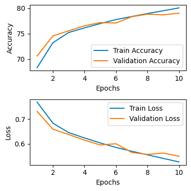

# Sentiment-Analysis-Using-Transformers
This repository contains implementation of powerful Transformer model for sentiment analysis based on the YELP text review and stars.

# Introduction

Sentiment analysis delves into the intricate world of emotions expressed
through text, be it in reviews, social media posts, or any written
content. It falls within the domain of natural language processing
(NLP), leveraging advanced machine learning techniques to decipher
whether the sentiment conveyed is positive, negative, or neutral. This
field aims to extract valuable insights from vast troves of unstructured
textual data, unraveling the collective sentiment of a populace on a
given subject. In essence, it is the art of scrutinizing text to uncover
the underlying attitude of its author. Employing state-of-the-art NLP
methodologies enables the prediction of the prevailing emotional
undertone within the text. Beyond a mere analytical tool, sentiment
analysis serves as a pivotal asset for businesses worldwide. Companies
harness its power to gauge customer satisfaction, conduct comprehensive
market research, and vigilantly monitor the ebb and flow of their brand
reputation across various platforms.

The report structure is organized as follows. Section 2 introduces the
background of sentiment analysis. Section 3 discusses the given
datasets, data exploration and preprocessing methods. Section 4 contains
the description of input dataset preparation for various models. Section
5 discusses evaluation metrics and machine learning models used
including convolutional neural networks, recurrent neural networks and
transformers. Section 6 contains the description of experiments carried
out for sentiment analysis on the given datasets. Section 7 is the
result section followed by challenges in section 8, and the paper is
concluded in the last section.

# Background

In 1940, Stagner’s \[1\] paper was the first to delve into public/expert
opinion, initially through surveys. Wiebe (1990) \[2\] introduced
computer-based sentiment analysis for subjective sentence detection.
Pang et al. (2002) \[3\] propelled modern sentiment analysis using
machine learning on movie review ratings, focusing on overall positive
or negative sentiment rather than specific topics. Some research focused
on multilabel sentiment classification, often excluding neutral
opinions. This exclusion can disrupt decision-making and cause
information loss. Valdivia et al. (2017) \[4\] proposed polarity
aggregation models considering neutrality proximity functions. Valdivia
et al. (2018) \[5\] used Ordered Weighted Averaging (OWA) operators to
filter neutral reviews via fuzzy majority. Santos et al. (2020) \[6\]
highlighted the relevance of examining neutral texts for understanding
specific frameworks dominated by a particular polarity. Ambivalent
opinions, blending positive and negative emotions, are often mistaken
for neutral; handling these improves sentiment sensing, as shown by Wang
et al. (2020) \[7\]. Wang et al. (2014) \[8\] categorized tweets based
on their predominant emotion—more positive as positive sentiment and
vice versa.

Xing et al. (2018) \[11\] described sentiment analysis as a multifaceted
task encompassing NLP areas like aspect extraction, subjectivity
detection, and more. Yadav and Vishwakarma (2020) \[12\] categorized
traditional sentiment analysis into three types: lexicon-based,
utilizing sentiment dictionaries; machine learning, employing
handcrafted features for classification; and deep learning, using
complex neural networks for capturing nuanced semantic features. Both
machine learning and deep learning approaches in sentiment analysis
often demand substantial annotated data for effective training, posing
challenges of overfitting and insufficient training data, as noted by
Pan and Yang (2009) \[13\]. To address this, transfer learning in NLP
has gained attention, aiming to enhance performance by leveraging
existing knowledge. Zhuang et al. (2020)\[14\] likened this process to
using piano-playing experience to expedite learning another instrument
like the violin. Sequential transfer learning, highlighted by Mao (2020)
\[15\], has excelled in pretraining large models on vast unlabeled data,
enabling the acquisition of universal linguistic representations
beneficial for various downstream NLP tasks.

In earlier assessments, sentiment analysis surveys took two distinct
research perspectives: one focusing on specific sentiment analysis
domains like emotion detection (Acheampong et al., 2021) \[16\],
cross-domain sentiment analysis (Al-Moslmi et al., 2017) \[17\], and
subjectivity detection (Chaturvedi et al., 2018) \[18\], while the other
emphasized a broad discussion of state-of-the-art methodologies within
sentiment analysis tasks, demonstrated by Zhang et al. (2018) \[19\],
Habimana et al. (2020) \[20\], and Yuan et al. (2020) \[21\], who
explored diverse deep learning approaches. Additionally, Liu et al.
(2019a) \[22\] delved into transfer learning’s application, Yue et al.
(2019) \[23\] critiqued various model architectures, and Birjali et al.
(2021) \[24\] covered machine learning algorithms in sentiment analysis.
Another study (reference \[25\]) adopted a novel ML-based classifier
approach analyzing people’s behavior on infectious diseases using
Twitter data from eight countries. The model utilized various base
classifiers—Naïve Bayes Support Vector Machines (NBSVM), CNN,
Bidirectional Gated Recurrent Network (BiGRU), fastText, and
DistilBERT - fusing them into a "Meta Classifier." This amalgamation
outperformed four DL and one machine learning approach, offering
promising results.

# Data Description

Yelp is a popular crowd-sourced review platform with millions of active
users who rate and review hundreds of thousands of businesses across the
globe. Since 2016, Yelp has been releasing and updating subsets of its
enormous database to the general public. We will use the Yelp review
dataset, which comprises around 174000 reviews with stars. Our goal is
to implement a powerful Transformer model for sentiment analysis based
on the text review and stars.

## Data Exploration

There are two columns in our dataset - *t**e**x**t* contains the text
reviews, and *s**t**a**r**s* contains the star ratings that accompany
the reviews. The ratings range from 1 to 5, with 1 being the lowest and
5 being the highest.

<figure>

<figcaption aria-hidden="true">Distribution of reviews with respect to
stars</figcaption>
</figure>

We notice that 5-star reviews are the most popular, and also that 1-star
reviews are more common than 2- or 3-star reviews. We can assume that
customers will go through the trouble of leaving a review only if they
were highly impressed or highly disappointed.

Using Matplotlib and WordCloud libraries in Python, a visual
representation of word frequency was generated for each unique star
rating in the dataset. Each WordCloud displays the most frequent words
in the reviews associated with the respective star rating.

<figure>

<figcaption aria-hidden="true">Distribution of reviews with respect to
stars</figcaption>
</figure>

## Preprocessing

The abundance of text data provides many opportunities for training the
NLP models. However, the unstructured nature of the text data requires
preprocessing. Lowercasing, spelling corrections, punctuation, and stop
word removal are some of these preprocessing steps. These operations
could be easily implemented in Python language using NumPy, pandas,
textblob, or nltk libraries.

### Remove Punctuation and Stopwords

The text data underwent preprocessing to eliminate punctuation marks and
stop words using NLTK’s English stop words collection. Punctuation was
removed utilizing regular expressions, and stop words were excluded from
the text.

### Convert All Words to Lowercase

All words within the text were transformed to lowercase to ensure
consistency and simplify subsequent processing. This step aids in
standardizing the text by converting all characters to their lowercase
equivalents.

### Convert Stars to Three Levels

The star ratings were transformed into three distinct sentiment levels:
‘positive’ for ratings greater than 3, ‘negative’ for ratings less than
or equal to 2, and ‘neutral’ for ratings equal to 3. This categorization
enables the classification of sentiments based on the provided star
ratings.

<figure>

<figcaption aria-hidden="true">Distribution of reviews with respect to
sentiment</figcaption>
</figure>

The data is still non-uniformly distributed. The positive reviews vastly
outnumber negative and neutral reviews, so any regular model will be
biased towards positive reviews. Thus, we need to look for strategies to
handle this imbalance. The below WordClouds display the most frequent
words in the reviews associated with the respective sentiment.

<figure>

<figcaption aria-hidden="true">Distribution of reviews with respect to
sentiment</figcaption>
</figure>

# Input Data Preparation

The input of the Transformer model is a fixed length review sequence
where integer numbers represent words. In this part, we need to build
vocabulary for the dataset and pad the review data to a fixed length.

## Tokenize the Sentences

The sentences in the ’text’ column of the train data were tokenized into
individual words using NLTK’s word_tokenize function. A tokenizer was
initialized to convert text data into sequences of integers. The
tokenizer was then trained on the preprocessed review data. The text
data was converted into sequences of integers using the trained
tokenizer, creating a sequence for each sentence. We find that the
maximum length among all tokenized sentences is 528, but the
distribution of lengths is not uniform. Most of the sentences are around
100 words after preprocessing.

<figure>

<figcaption aria-hidden="true">Sentence lengths distribution after
preprocessing</figcaption>
</figure>

So, a fixed maximum sequence length = 100 was established for padding
and truncating sequences. The sequences were padded to ensure a
consistent length of 100 tokens. Padding was done at the end of each
sequence, and if necessary, truncation was applied from the end as well.
The size of the vocabulary was determined by counting unique words after
tokenization. An additional token was added for padding, resulting in
the total vocabulary size.

## Train, Validation, Test Datasets

We have been provided with train and test dataset. We will split the
train dataset into training and validation using 70:30 split ratio. So
we have around 122329 sentences for training, 52427 for validation and
13980 for test.

## Specifics for CNN, RNN

*Tokenization and Vectorization:* Text in the training and testing
datasets was tokenized using TensorFlow Keras’ Tokenizer, limited to the
20,000 most common words. The text sequences were represented as vectors
of size 300 and transformed into sequences of integers. Padding was
applied to a maximum length of 300 tokens for both the training and
testing data.

*Label Encoding and One-Hot Encoding:* Categorical labels (’negative’,
’neutral’, ’positive’) were mapped to numerical values. The numerical
labels were converted into a one-hot encoded format for both training
and testing data.

## Specifics for transformer

*Vocabulary Building and Tokenization:* We tokenized reviews to
construct a vocabulary based on word frequency. A vocabulary mapping
words to indices is created, including special tokens like
 \< *u**n**k*\> (unknown),  \< *p**a**d*\> (padding),  \< *b**o**s*\>
(beginning of sentence), and  \< *e**o**s*\> (end of sentence). Reviews
are converted into sequences of indices and padded to a fixed length to
ensure uniformity.

*Data Transformation for Model Input:* The padded sequences are
converted into PyTorch tensors, preparing them for model input. Train
and test sequences are processed and structured into PyTorch tensors.
The data is split into training, validation, and test sets, and labels
are encoded into numerical values.

*Data Loaders for Model Training:* TensorDatasets and DataLoaders are
set up for efficient batch processing during model training. The
DataLoader splits the data into batches, ready for training, validation,
and testing of the sentiment analysis model.

## Specifics for transformer fine tuned on pre-trained models

We use the power of BERT, a state-of-the-art language model, to conduct
sentiment analysis on given data. The choice of BERT stems from its
advanced natural language understanding capabilities, making it an ideal
candidate for this task. By employing BERT’s tokenizer and embedding
capabilities, we convert text inputs into suitable numerical
representations for the model.

*Tokenization Analysis for Review Data*: The initial steps involve
analyzing the token lengths of preprocessed reviews. Leveraging BERT’s
tokenizer, we encode the reviews and collect the distribution of token
lengths. This analysis provides insight into the data structure and
informs the subsequent preprocessing steps.

*Dataset Preparation and Structure*: To facilitate model training, a
specialized ReviewDataset is constructed. This dataset encapsulates the
reviews and their associated sentiment labels, converting text inputs
into BERT-compatible numerical representations. This preparatory step
ensures seamless integration with the BERT model architecture.

*Train-Validation-Test Split and Class Weighting*: The dataset is
partitioned into distinct segments for training, validation, and
testing. We opt for a 70-30 split, allocating the majority for training
and a smaller portion for validation. Additionally, class weights are
computed to address the imbalances within the sentiment classes,
ensuring a balanced learning environment.

*PyTorch DataLoader Creation*: To enable efficient training and
evaluation, PyTorch DataLoader objects are crafted for the training,
validation, and test datasets. These loaders are instrumental in
batching, shuffling, and feeding the data to the model during the
learning process.

# Methods

## Evaluation Metric

We will use the following metrics for measuring and comparing model
performances:
$$\\text{Accuracy} = \\frac{tp+tn}{tp+tn+fp+fn}$$
$$\\text{Precision}: P = \\frac{tp}{tp+fp}$$
$$\\text{Recall}: R = \\frac{tp}{tp+fn}$$
$$\\text{F1 score}: F1 = 2\\times\\frac{P \\times R}{P + R}$$
$$\\text{Matthew's Correlation Coefficient} \[26\]: MCC = \\frac{tn\\times tp - fn \\times fp}{\\sqrt{(tp+fp)(tp+fn)(tn+fp)(tn+fn)}}$$
where *t**p*, *f**p*, *f**n* are the number of True Positives, False
Positives, and False Negatives respectively.

## Convolutional Neural Networks

Convolutional Neural Networks (CNNs) are deep learning models primarily
used for raw data like images and text. Their multi-layered
architecture, comprising convolutional and pooling layers, aims to
retain intricate features during data reduction. CNNs utilize *k* × *k*
filters (typically *k* = 3) to reshape and process data. These filters
act as weight-giving forms in the architecture, enabling extraction of
crucial features, thereby enhancing prediction accuracy and quality.

A sequential CNN model was constructed using TensorFlow Keras. The model
included various layers:

-   Embedding layer (20,000 words, 128 dimensions, input length 300)

-   Dropout layer with a rate of 0.5

-   1D Convolutional layer (64 filters, kernel size 5, ReLU activation)

-   MaxPooling layer (pool size 4)

-   LSTM layer (128 units)

-   Dense output layer with softmax activation for 3 classes
    (‘negative’, ‘neutral’, ‘positive’)

The model was compiled using categorical cross-entropy loss and the Adam
optimizer, with accuracy as the evaluation metric. Training was
conducted for 10 epochs on preprocessed training data (X_train,
y_train_encoded) with a 30% validation split. A batch size of 100 was
used, and the data were shuffled during training. Callbacks for variable
learning rate and model checkpoints were included.

## Recurrent Neural Networks

Neural networks use backpropagation to update weights via calculus’
chain rule. Deep networks face gradient issues like vanishing or
exploding gradients. Long Short-Term Memory (LSTM), an enhanced
Recurrent Neural Network, tackles vanishing gradients with a memory
cell. LSTM excels in learning long-range data, making it ideal for
sentiment analysis. Combining forward/backward RNNs into a single tensor
boosts LSTM model performance. Stacking multiple LSTM layers enhances
performance. We applied two LSTM layers and 0.5 dropout on hidden states
to avoid overfitting.

A sequential model was created using TensorFlow Keras. The RNN-based
model was composed of various layers:

-   Embedding layer with 20,000 words and 32 dimensions

-   Bidirectional LSTM layer with 64 units, set to return sequences

-   Another Bidirectional LSTM layer with 16 units

-   Dense layer with 64 units and ReLU activation

-   Dropout layer with a rate of 0.5

-   Dense output layer with softmax activation for 3 classes
    (‘negative’, ‘neutral’, ‘positive’)

The model was compiled using categorical cross-entropy loss and the Adam
optimizer, with accuracy as the evaluation metric. Training was
conducted for 10 epochs on preprocessed training data (X_train,
y_train_encoded) with a 30% validation split. A batch size of 100 was
used, and the data were shuffled during training. Callbacks for variable
learning rate and model checkpoints were included.

## Transformer from scratch

The transformer is a state of art network architecture proposed in 2017
\[14\]. In this state-of-art approach, the results showed that with the
use of a transformer, NLP tasks outperformed other techniques.
Transformers are deep learning models that were introduced in 2017 by
Vaswani et al. in the paper "Attention is All You Need". They are based
on the Transformer architecture and use self-attention mechanisms to
process the input sequence, allowing the model to capture the context
and dependencies between words. There are multiple components which
serve a crucial role in the Transformer architecture, facilitating
attention mechanisms, positional encoding, and classification tasks. The
TransformerEncoder and TransformerClassifier are designed to handle
sequences and perform classification using the Transformer model’s
encoded representations.

*Positional Encoding:* We used positional encodings to provide sequence
information to the Transformer model. We initializes positional
encodings for input sequences up to a maximum sequence length  = 100.
The forward method adds positional encodings to the input sequence
tensor.

*Multi-Head Attention:* We implemented multi-head attention mechanism
used within the Transformer model by first initializing linear
transformations for queries, keys, and values, along with a final linear
layer. The split_head method reshapes input tensor to prepare for
multi-head attention. The forward method performs multi-head attention
computation on query, key, and value tensors.

*Transformer Encoder Layer:* We implemented a single layer within the
Transformer Encoder, composed of multi-head attention and feed-forward
neural network blocks by initializing multi-head attention, feed-forward
layers, normalization, and dropout layers. The forward method executes
multi-head attention and feed-forward layers, applying normalization and
dropout.

*Transformer Encoder:* We aggregated multiple Transformer Encoder Layers
to form a complete Transformer Encoder. First, we sets up an embedding
layer, positional encoding, and multiple Transformer Encoder Layers. The
forward method embeds input tokens, applies positional encoding, and
passes data through multiple Transformer Encoder Layers.

*Transformer Classifier:* We added a classification layer on top of the
Transformer Encoder for specific classification tasks. It receives a
pre-defined TransformerEncoder and sets up a fully connected layer for
classification. The forward method uses the Transformer Encoder to
obtain embeddings and performs classification using a fully connected
layer.

This implementation allows for flexible usage and configuration of
Transformer-based models for various NLP tasks, leveraging multi-head
attention and positional encoding to handle sequential data efficiently.
We train the model using stochastic gradient descent in a mini-batch
fashion.

### Transformer using transfer learning

After transformer architecture, various models focusing on NLP fields
such as ROBERT \[27\], BERT \[28\], ELECTRA \[29\] were proposed.
Specifically, BERT (Bidirectional Encoder Representations from
Transformers) model is one of the most robust state-of-art approaches on
NLP fields. BERT was introduced in 2019 by Google AI Language, and since
then, it has started to be used very quickly in academics and industry.
BERT is a pre-trained model which is very easy to fine-tune model into
our dataset. It has a wide range of language options \[28\]. BERT
architecture is a multi-layer bidirectional transformer encoder. BERT
input representation has three embedding layers: position embedding,
segment embedding, and token embedding. In the pre-training part, BERT
applied two unsupervised tasks, Masked LM (MLM) and Next Sentence
Prediction (NSP), instead of traditional sequence modeling. BERT has
pre-trained with more than 3,000 M words.

We created a custom classifier by fine-tuning BERT, and training it to
accurately predict sentiment labels. The SentimentClassifier module is
meticulously designed to encapsulate a BERT model fine-tuned for
sentiment analysis. This architecture integrates BERT’s pre-trained
layers with additional fully connected layers to capture nuanced
sentiment information present in textual data. The training pipeline
incorporates strategies such as dropout regularization, AdamW optimizer,
and linear scheduler to enhance the model’s learning process. Training
is conducted over multiple epochs, where the model iteratively adjusts
its weights based on the provided data, minimizing a cross-entropy loss
function. During the training process, periodic evaluations on a
validation dataset are performed to gauge the model’s performance.
Metrics like accuracy and loss are computed to assess how well the model
generalizes to unseen data, ensuring it captures sentiment information
effectively.

# Experiments

The following models were evaluated:

## CNN Model

The CNN architecture included an embedding layer (128 dimensions, input
length 300), dropout (rate 0.5), a convolutional layer (64 filters,
kernel size 5, ReLU activation), max pooling (pool size 4), an LSTM
layer (128 units), and a dense softmax output layer (output size 3).

## RNN Model

RNN with an embedding layer of dimension 32, bidirectional LSTM layers
of 64 and 16 units, a dense hidden layer of 64 units with ReLU
activation, dropout of 0.5, and a softmax output layer with 3 units was
evaluated.

## Transformer Architectures

Several transformer architectures were explored, each defined by
different configurations of hidden layer dimensions, attention heads,
and layers. The experiments involved exploring the performance impact of
various setups, such as:

| Hidden Layer Dimensions | Number of Attention Heads | Number of Attention Layers |
|:-----------------------:|:-------------------------:|:--------------------------:|
|           128           |             4             |             4              |
|           128           |             8             |             8              |
|           64            |             4             |             4              |
|           64            |             8             |             8              |
|           256           |             8             |             8              |
|           512           |             8             |             8              |
|           512           |             8             |             4              |
|           512           |             4             |             8              |
|           512           |            16             |             16             |
|          1024           |            16             |             16             |

Transformer Architectures

## BERT Fine-Tuning

The BERT model pre-trained on uncased data was fine-tuned for sentiment
analysis using the ’bert-base-uncased’ architecture.

The performance metrics and comparative analysis of these models were
evaluated in terms of accuracy, loss, and computational efficiency to
determine their efficacy in sentiment analysis tasks.

## Training setup

The experiments were conducted on a Kaggle GPU environment to assess the
performance of various models for sentiment analysis.

|            Model             | Number of epochs |     |
|:----------------------------:|:----------------:|:---:|
|             CNN              |        10        |     |
|             RNN              |        10        |     |
|  Transformer \[128, 4, 4\]   |        10        |     |
|  Transformer \[128, 8, 8\]   |        10        |     |
|   Transformer \[64, 4, 4\]   |        10        |     |
|   Transformer \[64, 8, 8\]   |        10        |     |
|  Transformer \[256, 8, 8\]   |        10        |     |
|  Transformer \[512, 8, 8\]   |        10        |     |
|  Transformer \[512, 8, 4\]   |        10        |     |
|  Transformer \[512, 4, 8\]   |        10        |     |
| Transformer \[512, 16, 16\]  |        10        |     |
| Transformer \[1024, 16, 16\] |        10        |     |
|       Fine tuned BERT        |        2         |     |

Transformer Architectures

# Results

This section contains the results of training and testing. Among the
different transformer architectures created from scratch, highest
accuracy 87.6% is achieved for 512 hidden layer dimension and 16
attention layers. It also achieves the highest precision (0.791),
highest recall (0.705), highest f1 score (0.718) and highest mcc
(0.739). However when we use a a transformer fine tuned on BERT, we
achieve even higher values for all the metrics. CNN and RNN also perform
quite well in our case.

<figure>

<figcaption aria-hidden="true">CNN</figcaption>
</figure>

<figure>

<figcaption aria-hidden="true">RNN</figcaption>
</figure>

<figure>

<figcaption aria-hidden="true">Transformer [128, 4, 4]</figcaption>
</figure>

<figure>

<figcaption aria-hidden="true">Transformer [128, 8, 8]</figcaption>
</figure>

<figure>

<figcaption aria-hidden="true">Transformer [64, 4, 4]</figcaption>
</figure>

<figure>

<figcaption aria-hidden="true">Transformer [64, 8, 8]</figcaption>
</figure>

<figure>

<figcaption aria-hidden="true">Transformer [256, 4, 4]</figcaption>
</figure>

<figure>

<figcaption aria-hidden="true">Transformer [512, 8, 8]</figcaption>
</figure>

<figure>

<figcaption aria-hidden="true">Transformer [512, 8, 4]</figcaption>
</figure>

<figure>

<figcaption aria-hidden="true">Transformer [512, 4, 8]</figcaption>
</figure>

<figure>

<figcaption aria-hidden="true">Transformer [512, 16, 16]</figcaption>
</figure>

<figure>

<figcaption aria-hidden="true">Transformer [1024, 16, 16]</figcaption>
</figure>

<figure>

<figcaption aria-hidden="true">Fine tuned BERT</figcaption>
</figure>

<figure>

<figcaption aria-hidden="true">CNN</figcaption>
</figure>

<figure>

<figcaption aria-hidden="true">RNN</figcaption>
</figure>

<figure>

<figcaption aria-hidden="true">Transformer [128, 4, 4]</figcaption>
</figure>

<figure>

<figcaption aria-hidden="true">Transformer [128, 8, 8]</figcaption>
</figure>

<figure>

<figcaption aria-hidden="true">Transformer [64, 4, 4]</figcaption>
</figure>

<figure>

<figcaption aria-hidden="true">Transformer [64, 8, 8]</figcaption>
</figure>

<figure>

<figcaption aria-hidden="true">Transformer [256, 4, 4]</figcaption>
</figure>

<figure>

<figcaption aria-hidden="true">Transformer [512, 8, 8]</figcaption>
</figure>

<figure>

<figcaption aria-hidden="true">Transformer [512, 8, 4]</figcaption>
</figure>

<figure>

<figcaption aria-hidden="true">Transformer [512, 4, 8]</figcaption>
</figure>

<figure>

<figcaption aria-hidden="true">Transformer [512, 16, 16]</figcaption>
</figure>

<figure>

<figcaption aria-hidden="true">Transformer [1024, 16, 16]</figcaption>
</figure>

<figure>

<figcaption aria-hidden="true">Fine tuned BERT</figcaption>
</figure>

|            Model             | Precision | Recall | Accuracy | F1 score |  MCC  |
|:----------------------------:|:---------:|:------:|:--------:|:--------:|:-----:|
|             CNN              |   0.799   | 0.699  |  0.886   |  0.718   | 0.758 |
|             RNN              |   0.760   | 0.684  |  0.876   |  0.690   | 0.739 |
|  Transformer \[128, 4, 4\]   |   0.677   | 0.563  |  0.806   |  0.552   | 0.568 |
|  Transformer \[128, 8, 8\]   |   0.671   | 0.581  |  0.809   |  0.577   | 0.579 |
|   Transformer \[64, 4, 4\]   |   0.632   | 0.598  |  0.797   |  0.571   | 0.579 |
|   Transformer \[64, 8, 8\]   |   0.689   | 0.607  |  0.819   |  0.614   | 0.606 |
|  Transformer \[256, 8, 8\]   |   0.729   | 0.641  |  0.846   |  0.649   | 0.668 |
|  Transformer \[512, 8, 8\]   |   0.753   | 0.676  |  0.861   |  0.690   | 0.703 |
|  Transformer \[512, 8, 4\]   |   0.753   | 0.676  |  0.862   |  0.680   | 0.709 |
|  Transformer \[512, 4, 8\]   |   0.752   | 0.670  |  0.859   |  0.683   | 0.700 |
| Transformer \[512, 16, 16\]  |   0.791   | 0.705  |  0.876   |  0.718   | 0.739 |
| Transformer \[1024, 16, 16\] |   0.714   | 0.638  |  0.839   |  0.640   | 0.656 |
|       Fine tuned BERT        |   0.81    |  0.78  |  0.883   |   0.79   | 0.89  |

Metrics for complete training data

|            Model             | Precision | Recall | Accuracy | F1 score |  MCC  |
|:----------------------------:|:---------:|:------:|:--------:|:--------:|:-----:|
|             CNN              |   0.774   | 0.678  |  0.870   |  0.692   | 0.722 |
|             RNN              |   0.751   | 0.669  |  0.864   |  0.673   | 0.709 |
|  Transformer \[128, 4, 4\]   |   0.657   | 0.555  |  0.795   |  0.543   | 0.541 |
|  Transformer \[128, 8, 8\]   |   0.689   | 0.579  |  0.807   |  0.575   | 0.572 |
|   Transformer \[64, 4, 4\]   |   0.649   | 0.594  |  0.795   |  0.568   | 0.569 |
|   Transformer \[64, 8, 8\]   |   0.679   | 0.598  |  0.813   |  0.604   | 0.589 |
|  Transformer \[256, 8, 8\]   |   0.705   | 0.621  |  0.827   |  0.627   | 0.623 |
|  Transformer \[512, 8, 8\]   |   0.702   | 0.639  |  0.829   |  0.647   | 0.631 |
|  Transformer \[512, 8, 4\]   |   0.698   | 0.641  |  0.831   |  0.639   | 0.640 |
|  Transformer \[512, 4, 8\]   |   0.708   | 0.639  |  0.831   |  0.648   | 0.633 |
| Transformer \[512, 16, 16\]  |   0.704   | 0.645  |  0.835   |  0.647   | 0.647 |
| Transformer \[1024, 16, 16\] |   0.701   | 0.628  |  0.826   |  0.627   | 0.625 |
|       Fine tuned BERT        |   0.78    |  0.76  |   0.88   |   0.77   | 0.88  |

Metrics for test data

# Challenges

The dataset exhibits a non-uniform distribution across sentiment
classes, leading to challenges in model training and potential biases in
predictions. The computational resources available for training and
experimenting with complex models are restricted, affecting the
exploration of larger architectures or extensive hyperparameter tuning.

# Conclusion

In conclusion, we have experimented with various supervised learning
algorithms to predict sentiment of the Yelp reviews dataset based using
review text alone. We evaluated the effectiveness of different
algorithms based on accuracy, precision, recall, f1 score and mcc
measures. We concluded that as we increase the number of hidden layers
in transformer, model performance improves to a certain extent and then
starts decreasing. Increasing the number of attention heads and number
of attention layers show significant improvement for all the metrics in
general. Using transfer learning also proved to be helpful in our case
which might indicate that our dataset was small to train a very powerful
transformer from scratch. Nevertheless, we achieve 83.5% accuracy on
test dataset with our final transformer model.

# References

\[1\] Stagner R (1940) The cross-out technique as a method in public
opinion analysis. J Soc Psychol 11(1):79–90

\[2\] Wiebe JM (1990) Recognizing subjective sentences: a computational
investigation of narrative text. State University of New York at Buffalo

\[3\] Pang B, Lee L, Vaithyanathan S (2002) Thumbs up? Sentiment
classification using machine learning techniques. In: Proceedings of the
ACL-02 conference on empirical methods in natural language processing,
Morristown, NJ, USA. Association for Computational Linguistics, pp 79–86

\[4\] Valdivia A, Luzíón MV, Herrera F (2017) Neutrality in the
sentiment analysis problem based on fuzzy majority. In: 2017 IEEE
international conference on fuzzy systems (FUZZ-IEEE). IEEE, pp 1–6

\[5\] Valdivia A, Luzón MV, Cambria E, Herrera F (2018) Consensus vote
models for detecting and filtering neutrality in sentiment analysis. Inf
Fusion 44:126–135

\[6\] Santos G, Mota VF, Benevenuto F, Silva TH (2020) Neutrality may
matter: sentiment analysis in reviews of AIRBNB, booking, and
Couchsurfing in Brazil and USA. Soc Netw Anal Min 10(1):1–13

\[7\] Wang Z, Ho S-B, Cambria E (2020) Multi-level fine-scaled sentiment
sensing with ambivalence handling. Int J Uncertain Fuzz Knowl-Based Syst
28(04):683–697

\[8\] Wang Z, Joo V, Tong C, Xin X, Chin HC (2014) Anomaly detection
through enhanced sentiment analysis on social media data. In: 2014 IEEE
6th international conference on cloud computing technology and science.
IEEE, pp 917–922

\[9\] Sanh, V., Debut, L., Chaumond, J., Wolf, T.: DistilBERT, a
distilled version of BERT: smaller, faster, cheaper and lighter. arXiv
preprint arXiv:1910.01108 (2019)

\[10\] Yin, W., Kann, K., Yu, M., Schütze, H.: Comparative study of CNN
and RNN for natural language processing. arXiv preprint arXiv:1702.01923
(2017)

\[11\] Xing FZ, Cambria E, Welsch RE (2018) Natural language based
financial forecasting: a survey. Artif Intell Rev 50(1):49–73

\[12\] Yadav A, Vishwakarma DK (2020) Sentiment analysis using deep
learning architectures: a review. Artif Intell Rev 53(6):4335–4385

\[13\] Pan SJ, Yang Q (2009) A survey on transfer learning. IEEE Trans
Knowl Data Eng 22(10):1345–1359

\[14\] Zhuang F, Qi Z, Duan K, Xi D, Zhu Y, Zhu H, Xiong H, He Q (2020)
A comprehensive survey on transfer learning. Proc IEEE 109(1):43–76

\[15\] Mao HH (2020) A survey on self-supervised pre-training for
sequential transfer learning in neural networks. arXiv:2007.00800

\[16\] Acheampong FA, Nunoo-Mensah H, Chen W (2021) Transformer models
for text-based emotion detection: a review of bert-based approaches.
Artif Intell Rev 54:1–41

\[17\] Al-Moslmi T, Omar N, Abdullah S, Albared M (2017) Approaches to
cross-domain sentiment analysis: a systematic literature review. IEEE
Access 5:16173–16192

\[18\] Chaturvedi I, Cambria E, Welsch RE, Herrera F (2018)
Distinguishing between facts and opinions for sentiment analysis: survey
and challenges. Inf Fusion 44:65–77

\[19\] Zhang L, Wang S, Liu B (2018) Deep learning for sentiment
analysis: a survey. Wiley Interdiscip Rev 8(4):e1253

\[20\] Habimana O, Li Y, Li R, Gu X, Yu G (2020) Sentiment analysis
using deep learning approaches: an overview. Sci China Inf Sci
63(1):1–36

\[21\] Yuan J, Wu Y, Lu X, Zhao Y, Qin B, Liu T (2020) Recent advances
in deep learning based sentiment analysis. Sci China Technol Sci
63(10):1947–1970

\[22\] Liu R, Shi Y, Ji C, Jia M (2019) A survey of sentiment analysis
based on transfer learning. IEEE Access 7:85401–85412

\[23\] Yue L, Chen W, Li X, Zuo W, Yin M (2019) A survey of sentiment
analysis in social media. Knowl Inf Syst 60(2):617–663

\[24\] Birjali M, Kasri M, Beni-Hssane A (2021) A comprehensive survey
on sentiment analysis: approaches, challenges and trends. Knowl-Based
Syst 226:107134

\[25\] Balci, S., Demirci, G.M., Demirhan, H., Sarp, S. (2022).
Sentiment Analysis Using State of the Art Machine Learning Techniques.
In: Biele, C., Kacprzyk, J., Kopeć, W., Owsiński, J.W., Romanowski, A.,
Sikorski, M. (eds) Digital Interaction and Machine Intelligence. MIDI
2021. Lecture Notes in Networks and Systems, vol 440. Springer, Cham.
https://doi.org/10.1007/978-3-031-11432-8_3

\[26\] Chicco, D., Tötsch, N., Jurman, G. The Matthews correlation
coefficient (MCC) is more reliable than balanced accuracy, bookmaker
informedness, and markedness in two-class confusion matrix evaluation.
BioData Mining 14, 13 (2021). https://doi.org/10.1186/s13040-021-00244-z

\[27\] Pappagari, R., Zelasko, P., Villalba, J., Carmiel, Y., Dehak, N.:
December. Hierarchical transformers for long document classification.
In: 2019 IEEE Automatic Speech Recognition and Understanding Workshop
(ASRU), pp. 838–844. IEEE (2019)

\[28\] Devlin J., Chang, M., Lee, K., Toutanova, K.: BERT: Pre-training
of Deep Bidirectional Transformers for Language Understanding. NAACL
(2019)

\[29\] Clark, K., Luong, M.T., Le, Q.V., Manning, C.D.: Electra:
Pre-training text encoders as discriminators rather than generators.
arXiv preprint arXiv:2003.10555 (2020)

\[30\] Bordoloi, M., Biswas, S.K. Sentiment analysis: A survey on design
framework, applications and future scopes. Artif Intell Rev 56,
12505–12560 (2023). https://doi.org/10.1007/s10462-023-10442-2

\[31\] Professor Bobak Mortazavi and Teaching Assistant Zhale Nowroozilarki: For guidance, support, and valuable insights throughout the class.

